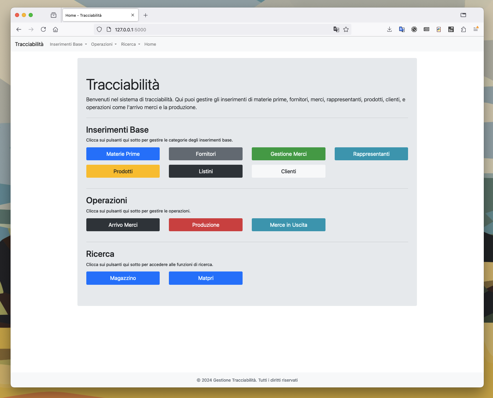

# Sistema di Tracciabilità - Gestione Produzione e Logistica



## Descrizione

Il Sistema di Tracciabilità è una soluzione completa per la gestione di materie prime, fornitori, prodotti, clienti, magazzino e operazioni logistiche. Sviluppato utilizzando **Flask** e **SQLite**, permette di monitorare l'intero ciclo produttivo e la gestione delle merci in entrata e in uscita. Con un'interfaccia intuitiva basata su **Bootstrap**, l'applicazione è altamente accessibile e personalizzabile.

### Funzionalità Principali

- **Inserimenti Base**
  - Gestione di **materie prime**, fornitori, rappresentanti, prodotti e listini.
  - Aggiunta e modifica delle destinazioni dei clienti.
  - Possibilità di associare listini ai clienti.

- **Operazioni**
  - **Arrivo merci**: tracciamento dei controlli di qualità, verifica documentale, ispezione visiva e altri controlli specifici.
  - **Produzione**: gestione dei lotti di produzione, con possibilità di visualizzare le materie prime utilizzate e i relativi valori nutrizionali.
  - **Merce in uscita**: generazione e gestione di documenti di spedizione, come DDT e fatture.

- **Ricerca Avanzata**
  - **Tracciabilità delle materie prime**: ricerca per lotto per individuare i prodotti creati con una specifica materia prima e i relativi dettagli di spedizione.
  - **Magazzino**: monitoraggio delle materie prime in uso, meno quelle già utilizzate nella produzione.

- **Gestione Valori Nutrizionali**
  - Calcolo dei valori nutrizionali per i prodotti in base alle materie prime utilizzate.
  - Visualizzazione e stampa delle schede di prodotto complete di ingredienti e valori nutrizionali.

- **Controlli di Arrivo Merci**
  - Gestione e registrazione dei controlli di arrivo merci: verifica imballaggi, temperatura, igiene del trasporto e non conformità.

- **Schede Dettagliate**
  - Generazione di schede dettagliate per arrivo merci e produzione con la possibilità di stampa.

### Tecnologie Utilizzate

- **Python** e **Flask** per il backend.
- **SQLite** per la gestione del database relazionale.
- **Bootstrap** per un'interfaccia utente reattiva e moderna.
- **Jinja2** per il templating e la visualizzazione dinamica dei dati.

### Installazione

1. Clona il repository:
   ```bash
   git clone https://github.com/tuo-repository.git
   ```

2. Installa le dipendenze:
   ```bash
   pip install -r requirements.txt
   ```

3. Esegui l'applicazione:
   ```bash
   python app.py
   ```

4. Accedi all'applicazione tramite il browser all'indirizzo `http://localhost:5000`.

### Struttura del Progetto

```bash
├── app.py
├── blueprints
│   ├── arrivo_merci.py
│   ├── clienti.py
│   ├── ditta.py
│   └── ...
├── database
│   └── tracabilita.db
├── static
│   ├── css
│   └── schede_tecniche_materie_prime
├── templates
│   ├── arrivo_merci
│   ├── clienti
│   └── ...
└── README.md
```

### Licenza

Questo progetto è rilasciato sotto la licenza MIT.
